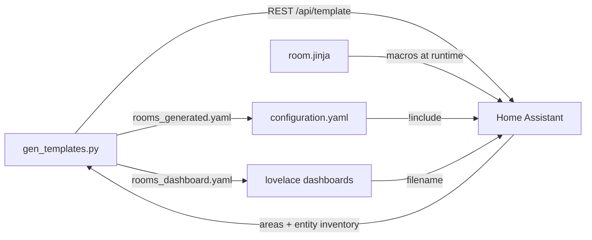

# HA Room Templater

[](https://github.com/romkey/ha-room-templater/actions/workflows/ci.yml)
[](https://github.com/romkey/ha-room-templater/actions/workflows/ci.yml)

Generate **per-room template sensors** for [Home Assistant](https://www.home-assistant.io/) that aggregate readings from every entity assigned to that area.

For each room (HA “area”), you get canonical entities such as average temperature, highest CO₂, total power, whether any door is open, and so on—without hand-writing dozens of template definitions.

The generator creates **every** canonical sensor for **every** area (except `EXCLUDE_AREAS`), so new devices start contributing as soon as they are assigned to a room. When no usable non-ignored sources exist, an **`availability`** template marks the entity unavailable (numeric `state` stays a valid number when available—no log spam).

## How it works



1. **`room.jinja`** — Jinja macros (avg, highest, any_on, …) that aggregate entities in an area by `device_class` or other rules. Installed once under your HA config.
2. **`gen_templates.py`** — Calls HA’s template API to list areas and inspect each area’s entities, then writes YAML template sensor definitions and a matching Lovelace dashboard.
3. **`rooms_generated.yaml`** — Included from `configuration.yaml` as a single file or split across a directory; reload HA after regenerating when areas or devices change.
4. **`rooms_dashboard.yaml`** — One dashboard tab per room, listing every template entity generated for that room.

## Requirements

- Home Assistant **2023.4+** (uses `areas()`, `area_entities()`, and the template REST API)
- Entities assigned to **areas** in HA (Settings → Areas)
- Source sensors should expose the correct **`device_class`** (e.g. `temperature`, `carbon_dioxide`) so macros can find them
- Python **3.10+**

## Quick start

### 1. Install the Jinja macros on Home Assistant

Copy `room.jinja` into your config directory:

```text
<config>/custom_templates/room.jinja
```

Reload templates: **Developer tools → YAML → Reload template entities**, or restart Home Assistant.

### 2. Configure this tool

```bash
python3 -m venv .venv
source .venv/bin/activate   # Windows: .venv\Scripts\activate
pip install -r requirements.txt
cp .env.example .env
```

Edit `.env`:

| Variable | Required | Description |
|----------|----------|-------------|
| `HA_URL` | yes | Base URL, e.g. `http://homeassistant.local:8123` |
| `HA_TOKEN` | yes | [Long-lived access token](https://www.home-assistant.io/docs/authentication/#your-account-profile) |
| `EXCLUDE_AREAS` | no | Comma-separated area names to skip |
| `OUTPUT_PATH` | no | Template sensor YAML (default: `rooms_generated.yaml`) |
| `DASHBOARD_OUTPUT_PATH` | no | Lovelace dashboard YAML (default: `rooms_dashboard.yaml`) |
| `NAME_PREFIX` | no | Prepended to each measurement name (default: `canonical_`; set empty to disable) |

### 3. Generate YAML

```bash
python gen_templates.py
# or: make generate
```

Optional flags override `.env` for a single run:

```bash
python gen_templates.py -o /path/to/config/rooms_generated.yaml \
  --dashboard-output /path/to/config/rooms_dashboard.yaml \
  --exclude-areas "Garage,Outside"
```

**Two-pass behavior.** When writing `rooms_dashboard.yaml`, the generator looks up each entity_id from `/api/states` (matched by friendly name) and uses HA's actual entity_id rather than guessing one from a name slug. This is robust against HA's slugify quirks and against "stuck" entity_ids in the entity registry (HA pins entity_id to unique_id on first registration, so any later name change leaves the entity_id frozen). On the **first run** — before HA has registered any of the generated entities — the lookup misses, the dashboard falls back to a python-slugify-based prediction, and you'll see "Unavailable" rows. After you've loaded `rooms_generated.yaml` and HA has registered the entities, **re-run `gen_templates.py`** and reload the Lovelace dashboard; the dashboard will now reference real entity_ids.

### 4. Include in Home Assistant

The generator writes a YAML **list** of template blocks (e.g. `- sensor:` / `- binary_sensor:`). Use either a single file or a directory of files—Home Assistant merges them the same way.

#### Option A: Single file

Copy or symlink the generated file into your config (or set `OUTPUT_PATH` to write there directly), then add to `configuration.yaml`:

```yaml
template: !include rooms_generated.yaml
```

#### Option B: Directory of YAML files

Useful if you want smaller files (e.g. one per room), clearer diffs, or to add hand-edited fragments alongside generated ones.

1. Create a directory under your config, for example `room_templates/`.
2. Place one or more `.yaml` files there. **Each file must be a YAML list** using the same structure as the generator output. Home Assistant concatenates every file in the directory.

Example layout:

```text
config/
├── configuration.yaml
└── room_templates/
    ├── kitchen.yaml
    ├── living_room.yaml
    └── binary.yaml
```

`kitchen.yaml` (only the entities for that room):

```yaml
- sensor:
  - name: Kitchen canonical_temperature
    unique_id: kitchen_canonical_temperature
    device_class: temperature
    unit_of_measurement: °C
    state: "…{{ (ns.values | sum / ns.values | count) | round(1) }}"
  - name: Kitchen canonical_lights on
    unique_id: kitchen_canonical_lights_on
    state: "{{ (area_entities('Kitchen') | select('search', '^light[.]') | … | select('is_state', 'on') | list | count) }}"
- binary_sensor:
  - name: Kitchen canonical_occupancy
    unique_id: kitchen_canonical_occupancy
    device_class: occupancy
    state: "{{ (area_entities('Kitchen') | select('is_state_attr', 'device_class', 'occupancy') | … | select('is_state', 'on') | list | count > 0) }}"
```

`living_room.yaml` would follow the same pattern for other areas. You can also split by entity type (all `sensor:` blocks in one file, all `binary_sensor:` blocks in another) instead of by room—each entity should appear in **only one** file.

Reference the directory from `configuration.yaml`:

```yaml
template: !include_dir_merge_list room_templates/
```

Only `.yaml` files directly in that folder are loaded (not subfolders). After changing any file, validate the config and reload template entities.

**Using the generator with a directory:** the tool still writes one file by default (`rooms_generated.yaml`). To use Option B you can:

- Copy or split the generated list into multiple files under `room_templates/` after each run, or
- Set `OUTPUT_PATH` to something like `room_templates/all_rooms.yaml` so one generated file lives inside the directory (still valid for `!include_dir_merge_list`), or
- Keep generating a single file for review and copy sections into per-room files you maintain yourself.

Both options are equivalent to Home Assistant as long as each included file is a list of `- sensor:` / `- binary_sensor:` blocks.

Validate and reload template entities.

### 5. Add the dashboard

Copy `rooms_dashboard.yaml` into your config directory (or set `DASHBOARD_OUTPUT_PATH` to write it there directly). Register it under `lovelace` in `configuration.yaml` (works alongside UI-mode dashboards):

```yaml
lovelace:
  mode: storage
  dashboards:
    room-summary:
      mode: yaml
      title: Rooms
      icon: mdi:floor-plan
      show_in_sidebar: true
      filename: rooms_dashboard.yaml
```

The dashboard key (`room-summary`) must contain a hyphen. Change `title` and `filename` to match your setup.

Restart Home Assistant or reload the relevant resources so the new dashboard appears in the sidebar. Regenerate both YAML files whenever areas or devices change, then reload template entities; refresh the browser if a tab still lists removed entities.

## Generated dashboard

Each included area gets one Lovelace **view** (tab) with a single **entities** card. From top to bottom:

1. **Area settings link** — a `weblink` row pointing at `/config/areas/area/<area_id>` (Settings → Areas and Zones → that area) so you can jump straight from a room's view to its area configuration. The link uses `new_tab: false` so it navigates in the current tab. If `gen_templates.py` can't fetch area ids (e.g. older HA build returning an unparseable template result), the link is silently omitted and the rest of the view still renders. Note that the Settings page requires an admin account — non-admin users will see the link but get a permission error if they tap it.
2. **Values** — canonical measurements (conditional rows; hidden when `unavailable` or `unknown`).
3. **Sources** — for each visible measurement, a subsection with **All**, **Active**, and **Ignored** (`_all_sensors`, `_active_sensors`, `_ignored_sensors`). Subsections use the same condition as the canonical value (only shown when that measurement is available).

### Example dashboard output

```yaml
views:
  - title: Kitchen
    path: kitchen
    cards:
      - type: entities
        title: Kitchen
        entities:
          - type: weblink
            name: Area settings
            icon: mdi:cog
            url: /config/areas/area/kitchen
            new_tab: false
          - type: conditional
            conditions:
              - entity: sensor.kitchen_canonical_temperature
                state_not: [unavailable, unknown]
            row:
              entity: sensor.kitchen_canonical_temperature
              name: canonical_temperature
          - type: section
            label: Sources
          - type: conditional
            conditions:
              - entity: sensor.kitchen_canonical_temperature
                state_not: [unavailable, unknown]
            row:
              type: section
              label: Temperature
          - type: conditional
            conditions:
              - entity: sensor.kitchen_canonical_temperature
                state_not: [unavailable, unknown]
            row:
              entity: sensor.kitchen_canonical_temperature_all_sensors
              name: All
```

Entity ids are derived the same way Home Assistant does from the template friendly name (`Kitchen canonical_temperature` → `sensor.kitchen_canonical_temperature`).

## Generated sensors

Each row below becomes one template entity **per area** when matching source entities exist.

| Name suffix | Kind | Aggregation | Matches |
|-------------|------|-------------|---------|
| Temperature, Humidity, Illuminance, Sound | sensor | average | `device_class` |
| CO₂, CO, NO₂, … VOC, PM*, AQI | sensor | maximum | `device_class` |
| Power, Energy | sensor | sum | `device_class` |
| Min Battery | sensor | minimum | `battery` |
| Lights On | sensor | count on | `light.*` in area |
| Occupancy, Door Open, Moisture | binary_sensor | any `on` | `device_class` |
| Vibration | binary_sensor | any matching switch `on` | switch friendly name contains `vibration` |
| Unlocked | binary_sensor | any lock `unlocked` | `lock.*` in area |

Friendly names look like **`Kitchen canonical_temperature`** (prefix + room + lowercase measurement). With the default `NAME_PREFIX=canonical_`, entity ids become `sensor.kitchen_canonical_temperature`. Set `NAME_PREFIX=` in `.env` to drop the prefix and use names like `Kitchen temperature` again.

Each canonical measurement also gets three **companion** sensors. Their **state** is the *count* of matching source entities (an integer); the comma-joined friendly names live in a `sources` attribute. Home Assistant caps an entity state at 255 characters, so a room with many sources (e.g. 31 temperature probes) would silently stay at `unknown` if the joined list were the state — the count keeps the entity valid while attributes are unbounded.

| Suffix | Example entity | State | `sources` attribute |
|--------|----------------|-------|---------------------|
| `_all_sensors` | `sensor.bedroom_canonical_temperature_all_sensors` | Number of every source entity in the area for that measurement | Comma-joined friendly names of those sources |
| `_active_sensors` | `sensor.bedroom_canonical_temperature_active_sensors` | Number of sources actually used in the calculation (numeric and not unavailable; for lights, only lights that are on) | Comma-joined friendly names of those sources |
| `_ignored_sensors` | `sensor.bedroom_canonical_temperature_ignored_sensors` | Number of sources in the area with the `ignore_canonical` label | Comma-joined friendly names of those sources |

Numeric measurements additionally get `_mismatched_unit_sensors` (count + names of sources whose unit cannot be converted to the canonical unit).

Companion sensors appear under **Sources** on the dashboard. Their rows are `type: attribute` rows that render the `sources` attribute directly, so you see the actual sensor names — useful for debugging. The count is still on the entity state and is visible in the more-info dialog if you click through.

### Example output

Each area is one template block of plain **state-based** template entities. Home Assistant re-evaluates them automatically whenever any entity referenced by `states(eid)` inside the macros changes, including when `label_entities('ignore_canonical')` membership changes from adding or removing labels. There is no `triggers:` block.

```yaml
- sensor:
  - name: Kitchen canonical_temperature
    unique_id: kitchen_canonical_temperature
    device_class: temperature
    unit_of_measurement: °C
    state: "…"
    availability: "…"
  binary_sensor:
  - name: Kitchen canonical_occupancy
    unique_id: kitchen_canonical_occupancy
    device_class: occupancy
    state: "{{ (area_entities('Kitchen') | select('is_state_attr', 'device_class', 'occupancy') | … ) }}"
```

Inlined `state` / `availability` lines are one long string each (no ``, no synthetic tracking variable).

## Ignoring source entities

Assign the Home Assistant **label** `ignore_canonical` to any entity you want excluded from all canonical aggregates in that room (temperature, lights, locks, etc.). Create the label under **Settings → Labels** (name must match exactly), then assign it to entities under **Settings → Entities**.

Ignored entities are omitted from the canonical value and the count of `_all_sensors` / `_active_sensors`, but counted in `_ignored_sensors` (with their friendly names in `sources`). Labels must be on the **entity**, not only the device.

If every source in a room is ignored (or none have usable states), the **main canonical entity** becomes `unavailable` via its availability template, and the canonical-value row is hidden from the dashboard. The **companion list entities** keep a broader availability (any entity of that device class exists in the area), so the dashboard's *Sources* subsection — anchored on `_all_sensors` — still renders, showing `All: 0`, `Active: 0`, `Ignored: N`, and `Mismatched units: 0`. That makes it easy to see *why* a measurement has no value. Only when the area has no entities of that device class at all does the whole subsection disappear.

**After adding or removing ignore labels**, the canonical sensor re-renders within a few seconds. Generated templates are state-based and Home Assistant tracks `label_entities()` membership as a dependency, so the aggregate updates as soon as the ignore list changes — no source-sensor value change or scheduled refresh is required. If a value still looks stale, **Developer tools → Actions** → `homeassistant.update_entity` on the canonical entity (or **Reload template entities**) forces an immediate re-evaluation.

Generated canonical template entities in the same area are **never** counted as sources (matched by `_canonical_` in the entity id). Without that, a temperature template could average in its own previous state and report nonsense values.

## Customization

### Exclude areas

In `.env`:

```env
EXCLUDE_AREAS=Garage,Outside,Utility
```

### Add or change sensor types

Edit the `SENSORS` list in `gen_templates.py`. Each entry needs:

- `kind` — `sensor` or `binary_sensor`
- `name` — suffix used in the friendly name
- `macro` — function in `room.jinja` (`avg`, `highest`, `total`, `lowest`, `lights_on`, `any_on`, `any_switch_named`, `any_unlocked`)
- `args` — arguments after the area name in the macro call
- `device_class` — HA device class on the template entity
- `unit` — `unit_of_measurement`, or `None` for binary sensors / unitless

Add new aggregation logic in `room.jinja`, then reference the new macro name in `SENSORS`.

### New macros

`room.jinja` builds entity lists with `area_entities()` filters inside each macro (no `from_json` needed in macros).

**Macros are not global.** Every template must import first, e.g. ``. The file must be named `room.jinja` (not `room.ninja`) under `custom_templates/`, then reload custom templates.

## Project layout

```text
ha-room-templater/
├── gen_templates.py      # generator script
├── room.jinja            # HA macros (install under custom_templates/)
├── requirements.txt
├── .env.example
├── Makefile
└── README.md
```

`rooms_generated.yaml` and `rooms_dashboard.yaml` are created locally and gitignored; point `OUTPUT_PATH` and `DASHBOARD_OUTPUT_PATH` at your HA config directory if you prefer. On Home Assistant, an optional `room_templates/` directory (see §4 option B) holds the included YAML files.

## Testing and debugging

Work through these steps in order. They isolate whether the problem is the generator, your HA connection, the Jinja macros, or the YAML install.

### 1. Generator and API

From this repo (with `.env` configured):

```bash
source .venv/bin/activate
python gen_templates.py
```

You should see a room list and counts for entities written. If this fails, fix `HA_URL` / `HA_TOKEN` first.

Probe the template API directly (replace URL and token):

```bash
curl -s -X POST "$HA_URL/api/template" \
  -H "Authorization: Bearer $HA_TOKEN" \
  -H "Content-Type: application/json" \
  -d '{"template": "{{ areas() | map(\"area_name\") | list | tojson }}"}'
```

You should get a JSON array of area names. If not, the token or URL is wrong.

### 2. Generated YAML sanity check

Open `rooms_generated.yaml` and inspect any `state:` line. It must be **one physical line** — no line break before `}}`. A wrapped template like this will not work in Home Assistant:

```yaml
# BAD — newline inside the template
state: '{{ avg(''Kitchen'', ''temperature'')
  }}'
```

After regenerating with a current `gen_templates.py`, each `state` should **not** contain `from 'room.jinja'` and should **not** wrap entities in a `triggers:` block. It should start with `{%-` (e.g. ``) or `{{` and contain the inlined macro body. There should be no `_hc_track` variable anywhere.

### 3. Test macros in Home Assistant

Before loading hundreds of entities, confirm `room.jinja` works:

1. Copy `room.jinja` to `<config>/custom_templates/room.jinja`.
2. **Developer tools → YAML → Reload template entities** (or call `homeassistant.reload_custom_templates`).
3. **Developer tools → Template**. Paste one line from your generated file (use your real area name):

```jinja
{{ avg('Kitchen', 'temperature') }}
```

To see which sources are active:

```jinja

{{ active_sensors_by_dc("John's Office", "carbon_dioxide") }}
```

Click **Check template**. You should get a number when sources exist. Test availability with `{{ available_numeric_by_dc("Kitchen", "temperature") }}` (True/False). Do not use `fromjson` — that filter does not exist; if you need JSON parsing elsewhere in HA use `from_json` (underscore). If you see `avg` is undefined, you omitted the `` line or did not reload custom templates.

If `avg('Kitchen', 'temperature')` is correct in this tool but `states('sensor.kitchen_canonical_temperature')` is wrong, see **Stuck canonical value** below.

**Why literal `state: 0` works, import stays at 0, and removing `availability` jumps to 151**

**Developer tools → Template** always loads `room.jinja`. In YAML template entities, **`` does not behave like the Template tool** on reload: literal `state: 0` applies; `state` with `from 'room.jinja'` often leaves the previous number (0 after your test). If **`availability` also uses that import**, reload can leave state frozen at 0 even when the Template tool shows the right `avg()`. **Commenting out `availability` and reloading** can surface an old state again (e.g. **151**) that is **not** a valid average of your current sources (one sensor at ~66 is not 151). That is often a **restored or stale** entity state, not what `avg()` would return today in the Template tool.

**Fix:** regenerate with current `gen_templates.py` — **inlines** both `state` and `availability` as state-based templates that re-render automatically when any referenced entity or label changes.

**Stuck canonical value** (`update_entity` does not help):

1. **History graph vs current state** — A flat graph only means no new samples were recorded. Check **Developer tools → States** → `sensor.kitchen_canonical_temperature` → **State** (not the graph).
2. **Paste the entity’s exact `state` template** from `rooms_generated.yaml` into **Developer tools → Template**. If the result is **66.4** but States still shows **0** or **151**, check for `from 'room.jinja'` in YAML (regenerate to inline) or a duplicate entity definition.
3. **List every Kitchen temperature source** (paste in Template tool after reloading `room.jinja`):

```jinja


- {{ eid }}: {{ states(eid) }} {{ state_attr(eid, 'unit_of_measurement') }}
  ignored={{ eid in label_entities('ignore_canonical') }}


avg()={{ avg('Kitchen', 'temperature') }}
entity={{ states('sensor.kitchen_canonical_temperature') }}
```

4. Deploy regenerated inlined YAML + **`template.reload`**, then **Reload template entities**. If the old value persists, use **Clearing a stuck template entity** below (HA core has no `entity_registry.remove_entity` action).
5. **Nuclear option** — Change `unique_id` in YAML for that one sensor (e.g. `kitchen_canonical_temperature_v2`), reload templates, use the new entity id in dashboards.

Also verify the area name matches HA exactly (same spelling and punctuation as in **Settings → Areas**):

```jinja
{{ areas() | map('area_name') | list }}
```

### 4. Load one entity manually

Pick a single block from `rooms_generated.yaml` (one room, one sensor) and add it under `template:` in `configuration.yaml`, or in a test file included via `!include_dir_merge_list`. Run **Check configuration** in Developer tools, then **Reload template entities**.

In **Settings → Entities**, search for `canonical_` (or your `NAME_PREFIX`) and confirm the entity exists and updates.

### 5. Logs

After reload, check **Settings → System → Logs** for `template`, `jinja`, or `room.jinja` errors. Common messages:

- cannot import / unknown macro → `room.jinja` not in `custom_templates/` or not reloaded
- `TemplateError` → broken `state` string (often a wrapped line in YAML) or wrong area name
- duplicate `unique_id` → remove old template entities or change `NAME_PREFIX`

### 6. Dashboard

The dashboard only references entity ids that exist after step 4. In **Developer tools → States**, confirm e.g. `sensor.kitchen_canonical_temperature` exists before expecting the Rooms dashboard card to work.

## Troubleshooting

| Problem | What to check |
|---------|----------------|
| `Missing required environment variable` | `.env` exists with `HA_URL` and `HA_TOKEN` |
| `state` split across two lines in YAML | Regenerate with current `gen_templates.py` (fixes PyYAML line wrapping) |
| API 401 / 403 | Token valid; user can use template API |
| API 404 on `/api/template` | HA version; template integration enabled |
| No entities for a room | Devices assigned to that **area**; sensors have expected **device_class** |
| Template errors after reload | `room.jinja` present under `custom_templates/` and templates reloaded |
| `avg()` correct but canonical flat for hours after ignore labels | YAML is still the old trigger-based form; regenerate so each block has no `triggers:` key (state-based templates re-render automatically when labels change). Then **Reload template entities**. |
| `update_entity` does not change canonical | Paste exact `state` template in Template tool; if tool shows 66.4 but States shows 151, regenerate inlined YAML and clear stuck entity (below). |
| `avg()` correct but canonical entity stuck (e.g. 151) | Regenerate YAML (state-based, inlined `state`/`availability`, no `triggers:`), deploy, reload templates. Clear stuck entity if needed (below). |

### Clearing a stuck template entity

Home Assistant **core does not expose** an `entity_registry.remove_entity` service in **Developer tools → Actions**. Options that work without extra integrations:

1. **Change `unique_id`** for that sensor in `rooms_generated.yaml` (e.g. `kitchen_canonical_temperature_v2`), deploy, **Reload template entities**. Home Assistant creates a new entity; ignore or delete the old `sensor.kitchen_canonical_temperature` entry under **Settings → Entities** if it remains.
2. **Remove the entity block from YAML**, **Reload template entities** (entity should disappear), restore the block from a fresh `gen_templates.py` run, reload again.
3. **Restart Home Assistant** after deploying inlined YAML — a fresh start forces a full re-evaluation of every state-based template entity.

Optional: custom integrations (e.g. Spook, archived `ha-registry`) expose registry removal services; not required for normal use.

### Entity_id pinned by registry after a rename

HA's entity registry pins `entity_id` to `unique_id` on first registration. If you rename an area (e.g. `John’s Office` → `John's Office`), HA notices the unique_id is still the same and **keeps the original entity_id forever** — only the friendly name updates. The dashboard cross-references entity_ids via `/api/states` for this reason, so re-running `gen_templates.py` after HA has the entities registered will produce a dashboard that points at the actual entity_ids regardless of whether they look "right" relative to the current name. If you want the entity_id itself to follow the new name, you must either (a) rename it under **Settings → Entities → click entity → Settings → Entity ID**, or (b) delete the registry row using one of the techniques above, then reload templates.

### Why each template entry sets `default_entity_id`

Every generated entry includes a `default_entity_id` line (e.g. `default_entity_id: sensor.johns_office_canonical_temperature`). It's the same value as `unique_id` with the domain prefix prepended. HA's template integration accepts this key (see `homeassistant.components.template.schemas.make_template_entity_base_schema`) and uses it as the entity_id when the entity is **first registered**, instead of slugifying the friendly `name`. Without it, an area like `John’s Office` (U+2019 apostrophe) gets slugified by HA's `python-slugify` to `johns_office`, while a naive slug would produce `john_s_office` — making dashboard references point at sensors that don't exist. Setting `default_entity_id` removes that whole class of guess-and-hope behavior.

Already-registered entities keep their existing entity_id (the registry wins), so `default_entity_id` only helps on the first registration. To get the new naming on existing entities, delete the registry rows (see fixes above) and reload templates.

### Dashboard resolution report

After writing the dashboard, `gen_templates.py` prints a report comparing every dashboard entity reference against the friendly_name → entity_id map fetched from `/api/states`. If every reference is confirmed in HA's registry, you get one line:

```
Dashboard: all 360 entity references verified against Home Assistant's registry.
```

If anything doesn't match, the report lists each unresolved reference paired with the **closest** friendly_name HA does know about, so a near-miss (smart apostrophe vs straight apostrophe, trailing whitespace, area renamed) is immediately visible:

```
Dashboard: 358 of 360 entity refs confirmed in HA; 2 unresolved.
Unresolved references (closest HA friendly_name shown when available):
  - want:  "John's Office canonical_temperature" -> sensor.john_s_office_canonical_temperature
    have:  "John’s Office canonical_temperature" -> sensor.johns_office_canonical_temperature
```

When `want` and `have` differ only by punctuation/case, HA has the entity under a different friendly_name. Pick one to win: either rename the area in HA (Settings → Areas), or delete the registry rows (Settings → Entities) so they re-register with the name from `rooms_generated.yaml`. When there's no close match at all, the templates simply haven't been deployed yet — add the `!include`, reload (or restart), re-run.
| Canonical value wrong (e.g. 151 vs 66) | 151°F ≈ 66°C — compare raw `states()` values, not only the UI. Check the `sources` attribute of `_active_sensors`; ignore labels on **entities**; `_canonical_` excluded from averages |
| Wrong aggregation | Edit macro in `room.jinja` or change `macro` in `SENSORS` |
| Dashboard row missing | Canonical entity is `unavailable` (no sources or all ignored); row appears when sources exist |
| Dashboard row never appears | Reload templates; confirm entity id matches generated YAML; check area/device_class |
| Dashboard row "Unavailable" after the templates loaded fine | First-run case: dashboard was generated before HA registered the entities. Re-run `gen_templates.py` and reload the dashboard. |

Regenerate after adding devices, moving entities between areas, or renaming areas.

## License

MIT — see [LICENSE](LICENSE).
